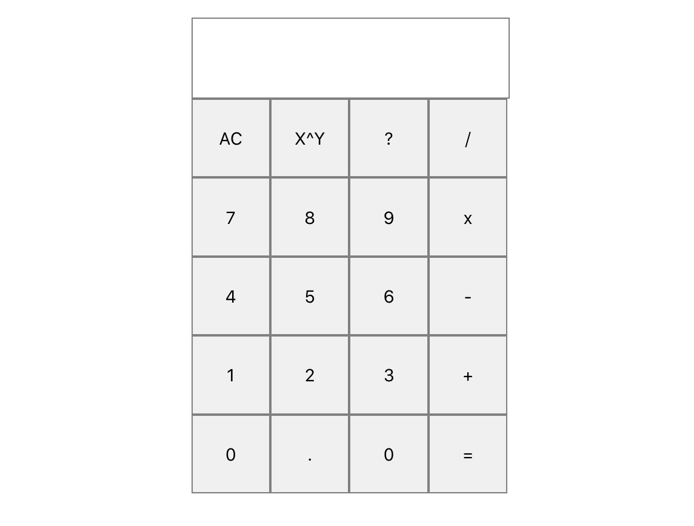

# React Calculator

<!-- PROJECT LOGO -->
 

  <h1 align="center">React Calculator</h1>
   

<!-- TABLE OF CONTENTS -->

  
Table of Contents

  <ol>
    <li>
      <a href="#about-the-project">About The Project</a>
      <ul>
        <li><a href="#built-with">Built With</a></li>
      </ul>
    </li>
    <li><a href="#contact">Contact</a></li>
    <li><a href="#acknowledgements">Acknowledgements</a></li>
  </ol>

<!-- ABOUT THE PROJECT -->
## About The Project

A basic calculator created using React that can add, subtract, multiple, divide, and figure exponents.

A simple project figured out on my own using the React documentation as a guide.  A Javascript background does make the concepts easier to grasp.

### Built With

* [React](https://reactjs.org)
* [JavaScript](https://www.ecma-international.org/technical-committees/tc39/)

<!-- CONTACT -->
## Contact

Jake Simmens - [LinkedIn](https://linkedin.com/in/jakesimmens) - jake@jakesimmens.com

<!--Project Link: [http://jakesimmens.com](http://jakesimmens.com) -->

<!-- ACKNOWLEDGEMENTS -->
## Acknowledgements
* [Emerson Doyah](https://github.com/emerzonic) - He got me to checkout React
* [Othneil Drew](https://github.com/othneildrew/Best-README-Template) - Readme template
